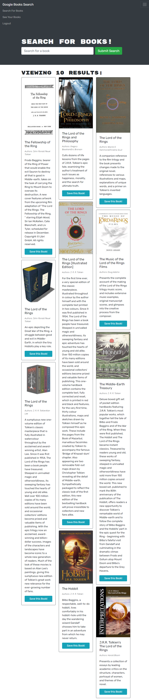

# Find A Book

## Description
Web application which started as a RESTful API and needed to be refactored into a GraphQL API built with Apollo Server. Application allows users to search for books using Google's book search API and save them to a profile they can sign up for.

## Steps Taken
* Install needed Apollo and GraphQL packages.

* Update the auth middleware to work with GraphQL. 

* Write resolvers and typeDefs, as well as the mutations that will be used.

* Create an Apollo Provider for the client side.

* Update Search and Save book functions, as well as the Sign Up and Login functions to use mutations instead of API functions.

## Webpage

Link: https://powerful-lowlands-44621.herokuapp.com/

## Contributors
This application was created by Andrew Secore